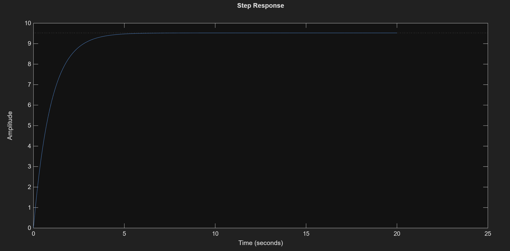
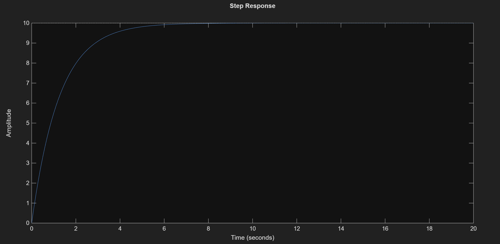

# Adaptive Cruise Control (ACC) with PID Controller

This project focuses on the design and simulation of a PID Controller for an Adaptive Cruise Control system using MATLAB. The objective is to control a vehicle's speed to reach a target velocity with high precision and stability.

## Project Overview

- **System Modeling:** Modeled vehicle dynamics using a transfer function based on mass and damping.
- **Controller Strategy:** Developed and compared Proportional (P) and Proportional-Integral (PI) control strategies.
- **Error Correction:** Implemented an Integral gain to eliminate steady-state error and ensure the vehicle reaches the exact reference speed.

## Simulation Results & Performance Analysis

I analyzed the system's step response under two different control configurations:

### 1. Proportional (P) Control
Using only Kp, the system responds quickly but exhibits a steady-state error, failing to reach the 10 m/s reference.

### 2. PI Control (Optimized)
By adding an Integral gain, the steady-state error is removed, and the vehicle maintains a perfect 10 m/s target speed.

## Folder Structure
- `src/`: MATLAB script containing the control logic (`acc_pid_controller.m`).
- `results/`: Performance plots comparing different controller gains.

---
### 🔍 Acknowledgments & Industry Context
- **Course Reference:** This project was developed as part of the **"MATLAB/SIMULINK Bible | Go From Zero to Hero + ChatGPT!
"** course by **Ryan Ahmed**.
- **Application:** In modern automotive engineering, PID control is a standard method for controlling vehicle speed in systems like Adaptive Cruise Control (ACC) and other driver assistance technologies.

Developed by Efe Erden Control and Automation Engineering Student @ Yıldız Technical University
